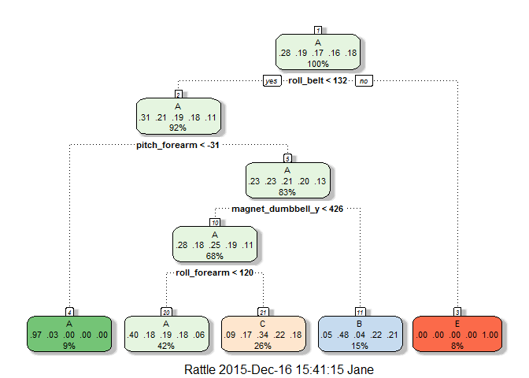

# Practical Machine Learning Project
J. Hartsfield  
December 10, 2015  
Can we predict whether or not someone has lifted weights correctly using data from accelerometers on the belt, forearm, arm and dumbbell?  We use data gathered on 6 participants who were asked to perform barbell lifts correctly and incorrectly in 5 different ways.  The results of their exercises were recorded and will be used to predict whether or not other lifting is done correctly or not.  If incorrect, the basic type of incorrect behavior will be predicted.  

More information is available from the website here: http://groupware.les.inf.puc-rio.br/har (see the section on the Weight Lifting Exercise Dataset).

## Load and pre-process data

We load the libraries we need and download the datasets from the internet.  After reading in the datasets, we eliminate the first 7 columns since they are not applicable to predicting the result. We also eliminate all columns that are mostly NA or empty. 

We analyze the covariates to see if we any have near zero variance.  They do not, so there is no need to remove columns on that basis. We then divide the training set into 4 folds (mutually exclusive random subsets of the observations).  Each fold is then divided into a training dataset and a testing dataset. 


## Examine different methods to check effectiveness

### Classification Tree

We use classification tree to predict with trees on the first training set (training1) and look at the tree plot.  

 

```
##  Accuracy 
## 0.4853642
```

```
##            
## treePredict   A   B   C   D   E
##           A 375 117 115 100  45
##           B   9  98   9  50  44
##           C  34  69 132  91  73
##           D   0   0   0   0   0
##           E   0   0   0   0 108
```

We see that this method only gave us a 48.5364193% overall accuracy.

### Random Forest

Again we pre-process the data to center and scale the predictors. We use random forest on the second training set (training2).

```
##  Accuracy 
## 0.9687075
```

```
##          
## rfPredict   A   B   C   D   E
##         A 415   9   1   0   0
##         B   2 271  11   1   0
##         C   1   4 243  13   0
##         D   0   1   1 227   2
##         E   0   0   0   0 268
```
This gives us a 96.8707483% overall accuracy. Clearly this is much better than the tree method.

### Boosting

We now use the boosting method on training set 3 (training3) combined with pre-processing and cross-validation.

```
##  Accuracy 
## 0.9312925
```

```
##             
## boostPredict   A   B   C   D   E
##            A 405  16   1   0   1
##            B   5 257  14   7   6
##            C   5  10 236  10   6
##            D   1   1   4 219   6
##            E   2   0   1   5 252
```
Boosting gives us a 93.1292517% overall accuracy.

## Linear discriminant analysis

Lastly, we try linear discriminant analysis on training set 4 (training4) again with pre-processing and cross-validation.

```
##  Accuracy 
## 0.6861811
```

```
##           
## ldaPredict   A   B   C   D   E
##          A 335  44  32  13  11
##          B  12 183  33  12  43
##          C  40  37 154  28  29
##          D  30  13  33 171  22
##          E   1   7   4  17 165
```
LDA gives us a 68.6181076% overall accuracy.

## Choose a model, make predictions, estimate error

Based on the results we achieved for the different models, we choose to use the random forest method to predict our results.  We will also use the boosting as a second choice to see how it differs on the test data from the random forest method.
We apply the random forest method to each of our training and testing datasets and average the error rates to get an estimate of the out-of-sample error.  


Based on the above, we estimate our out-of-sample error to be 1 - the average accuracy of the random forest method or 0.0217758. 

Where do the two models produce different responses? What are the predictions for our test dataset from the two models?  We list the predictions for the application of each of the 4 random forest fits to the testing set followed by the boosting fit applied to the testing set.


```
##             rf3Predict
## boostPredict   A   B   C   D   E
##            A 407  13   1   1   1
##            B   7 258  11   7   6
##            C   3  14 236   8   6
##            D   1   1   4 219   6
##            E   2   0   1   5 252
```

```
##  [1] B A A A A E D B A A B C B A E E A B B B
## Levels: A B C D E
```

```
##  [1] B A A A A E D B A A B C B A E E A B B B
## Levels: A B C D E
```

```
##  [1] B A B A A E D B A A B C B A E E A B B B
## Levels: A B C D E
```

```
##  [1] B A C A A E D B A A B C B A E E A B B B
## Levels: A B C D E
```

```
##  [1] B A B A A E D B A A B C B A E E A B B B
## Levels: A B C D E
```

## Appendix

Here is the code that was used in the document.
 

```r
# load libraries and data
library(caret)
library(randomForest)
library(rattle)
library(rpart.plot)
# library(gbm)

url_training <- "http://d396qusza40orc.cloudfront.net/predmachlearn/pml-training.csv"
url_testing <- "http://d396qusza40orc.cloudfront.net/predmachlearn/pml-testing.csv"
download.file(url=url_training, destfile="../pml-training.csv")
download.file(url=url_training, destfile="../pml_testing.csv")

# read in, replacing empty cells with NA
trainingAll <- read.csv("../pml-training.csv",na.strings=c("NA",""), header=TRUE)
testingAll <- read.csv("../pml-testing.csv",na.strings=c("NA",""), header=TRUE)

# get rid of first 7 columns (nothing important for prediction) and columns with nothing or NA in them
trainingAll <- trainingAll[,-1:-7]
testingAll <- testingAll[,-1:-7]

# find total number of training observations
Ntot <- dim(trainingAll)[[1]] 
# find indices of columns with over half NA values
wntg<-which(colSums(is.na(trainingAll))>Ntot/2)
trainingAll <- trainingAll[,-c(wntg)]
testingAll <- testingAll[,-c(wntg)]

# check to see if there are any zero covariates
nsv <- nearZeroVar(trainingAll,saveMetrics=TRUE)
nsv

# split training data into 4 randomly sampled datasets
set.seed(1234)
folds <- createFolds(trainingAll$classe,k=4)
data1 <- trainingAll[folds$Fold1,]
data2 <- trainingAll[folds$Fold2,]
data3 <- trainingAll[folds$Fold3,]
data4 <- trainingAll[folds$Fold4,]
set.seed(1234)
inTrain1 <- createDataPartition(y=data1$classe, p = 0.7, list=FALSE)
training1 <- data1[inTrain1,]; testing1 <- data1[-inTrain1,]
set.seed(1234)
inTrain2 <- createDataPartition(y=data2$classe, p = 0.7, list=FALSE)
training2 <- data1[inTrain2,]; testing2 <- data2[-inTrain2,]
set.seed(1234)
inTrain3 <- createDataPartition(y=data3$classe, p = 0.7, list=FALSE)
training3 <- data3[inTrain3,]; testing3 <- data1[-inTrain3,]
set.seed(1234)
inTrain4 <- createDataPartition(y=data4$classe, p = 0.7, list=FALSE)
training4 <- data4[inTrain4,]; testing4 <- data4[-inTrain4,]
# break overall dataset into training and testing sets

inTrain <- createDataPartition(y=trainingAll$classe, p = 0.7, list=FALSE)
training <- trainingAll[inTrain,]; testing <- trainingAll[-inTrain,]
```


```r
# Classification Tree
treeFit <- train(classe ~., method="rpart", data=training1)
fancyRpartPlot(treeFit$finalModel)
treePredict <- predict(treeFit,newdata=testing1)
cmTree <- confusionMatrix(testing1$classe,treePredict)
cmTree$overall[1]  # print out overall accuracy
table(treePredict,testing1$classe)
```


```r
# Random Forest
rfFit <- train(classe ~., method="rf", prox=TRUE, preProcess=c("center", "scale"), trControl=trainControl(method = "cv", number = 4), data=training2)
rfPredict <- predict(rfFit,newdata=testing2)
cmRF <- confusionMatrix(testing2$classe,rfPredict)
cmRF$overall[1]  # print out overall accuracy
table(rfPredict,testing2$classe)
```


```r
# Boosting
boostFit <- train(classe ~., method="gbm", data=training3, verbose=FALSE,preProcess=c("center", "scale"), trControl=trainControl(method = "cv", number = 4))
boostPredict <- predict(boostFit,newdata=testing3)
cmBoost <- confusionMatrix(testing3$classe,boostPredict)
cmBoost$overall[1]  # print out overall accuracy
table(boostPredict,testing3$classe)
```


```r
# Linear Discriminant Analysis
ldaFit <- train(classe ~., method="lda", data=training4)
ldaPredict <- predict(ldaFit,newdata=testing4)
cmLDA <- confusionMatrix(testing4$classe,ldaPredict)
cmLDA$overall[1]  # print out overall accuracy
table(ldaPredict,testing4$classe)
```


```r
# Random Forest applied to other training sets
rf1Fit <- train(classe ~., method="rf", prox=TRUE, preProcess=c("center", "scale"), trControl=trainControl(method = "cv", number = 4), data=training1)
rf1Predict <- predict(rfFit,newdata=testing1)
cm1RF <- confusionMatrix(testing1$classe,rf1Predict)
acc1 <- cm1RF$overall[1]  # print out overall accuracy
rf3Fit <- train(classe ~., method="rf", prox=TRUE, preProcess=c("center", "scale"), trControl=trainControl(method = "cv", number = 4), data=training3)
rf3Predict <- predict(rfFit,newdata=testing3)
cm3RF <- confusionMatrix(testing3$classe,rf3Predict)
acc3 <- cm3RF$overall[1]  # print out overall accuracy
rf4Fit <- train(classe ~., method="rf", prox=TRUE, preProcess=c("center", "scale"), trControl=trainControl(method = "cv", number = 4), data=training4)
rf4Predict <- predict(rfFit,newdata=testing4)
cm4RF <- confusionMatrix(testing4$classe,rf4Predict)
acc4 <- cm4RF$overall[1]  # print out overall accuracy
```


```r
# Compare boosting and random forest results on their training set 3
table(boostPredict,rf3Predict)
# predictions of random forest models on testing data
rf1Predictions <- predict(rf1Fit, newdata=testingAll)
rfPredictions <- predict(rfFit, newdata=testingAll)
rf3Predictions <- predict(rf3Fit, newdata=testingAll)
rf4Predictions <- predict(rf4Fit, newdata=testingAll)
# predictions of boosting algorithm on testing data
boostPredictions <- predict(boostFit, newdata=testingAll)
rf1Predictions
rfPredictions
rf3Predictions
rf4Predictions
boostPredictions
```
